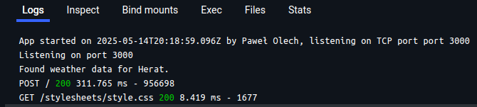
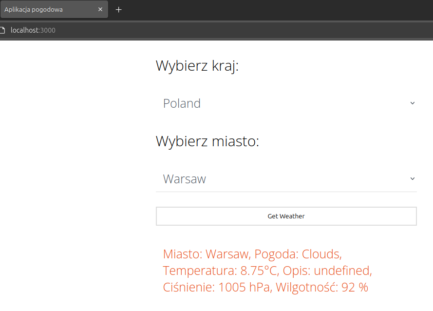
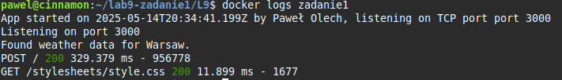
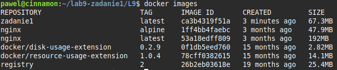
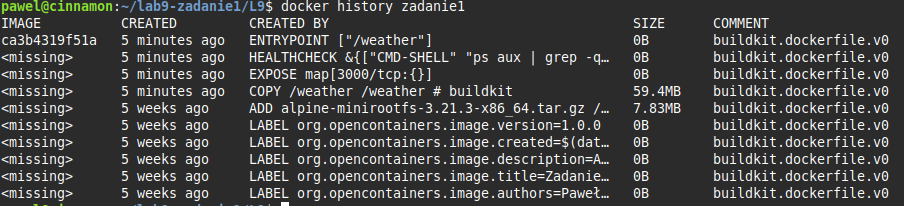

# PAwChO-zadanie1

Obraz można pobrać poprzez polecenia:
```bash
docker pull extremical/zadanie1:latest
```
```bash
docker pull ghcr.io/extremewars/pawcho-zadanie1:latest
```

# Działanie aplikacji

Proszę opracować aplikację (dowolny język programowania), która realizować będzie następującą
funkcjonalność:
1. Po uruchomieniu kontenera z tą aplikacją, pozostawi ona w logach informację o dacie
uruchomienia, imieniu i nazwisku autora programu oraz porcie TCP, na którym aplikacja ta
„nasłuchuje”.  
   W pliku src/bin/www została zmodyfikowana funkcja onListening by podczas uruchamiania wypisywała autora, port TCP i datę.
   ```js
   server.on('listening', onListening);
   
   /*
   (...)
   */
   
   function onListening() {
     var addr = server.address();
     var bind = typeof addr === 'string'
       ? 'pipe ' + addr
       : 'port ' + addr.port;
   
     const author = 'Paweł Olech';
     const now = new Date().toISOString();
     
     console.log(`App started on ${now} by ${author}, listening on TCP port ${bind}`);
   
     debug('Listening on ' + bind);
     console.log('Listening on ' + bind);
   }
   ```
   
   

2. Aplikacja pozwala na wybranie kraju i miasta (np. z predefiniowanej listy) oraz zatwierdzenie tego wyboru.  
Na podstawie tych informacji aplikacja powinna wyświetlić aktualną pogodę w wybranej lokalizacji.  
Zakres informacji pogodowych pozostawiam do decyzji autorów kodu tak jak i projekt i formę UI.  
W sprawozdaniu proszę umieścić kod oprogramowania wraz z niezbędnymi komentarzami.  
\
Do pobrania pogody wykorzystywany został OpenWeatherApi, który za pomocą linku i klucza w src/config.js pobiera informacje o pogodzie dla wskazanej lokalizacji.

   

# Dockerfile

Opracować plik Dockerfile, który pozwoli na zbudowanie obrazu umożliwiającego uruchomienie
aplikacji opracowanej w punkcie 1 jako kontener Docker.  
Przy ocenie brane będzie sposób opracowania tego pliku (wieloetapowe budowanie obrazu, ewentualne wykorzystanie warstwy
scratch, optymalizacja funkcjonowania cache-a w procesie budowania, optymalizacja pod kątem
zawartości i ilości warstw, healthcheck itd ).  
Plik Dockerfile powinien również zawierać informację na
temat autora tego pliku (imię oraz nazwisko studenta) zgodną ze standardem OCI.  
W sprawozdaniu proszę umieścić plik Dockerfile wraz z niezbędnymi komentarzami.

```dockerfile
# Etap pierwszy - utworzenie binarnej wersji aplikacji
FROM node:22-alpine AS build1
# Obsługa argumentu
ARG VERSION
ENV APP_VER=production.${VERSION:-v1.0}
# Katalog roboczy
WORKDIR /app
# Skopiowanie spisu zależności, jeśli się nie zmieniły część warstw zostanie pobrana z cache'a
COPY src/package*.json ./
# Instalacja zależności
RUN npm install
# Instalacja pakietu pkg umożliwiającego utworzyć plik wykonywalny projektu
RUN npm install -g pkg
# Skopiowanie plików źródłowych
COPY src/ ./
# Utworzenie pliku wykonywalnego
RUN pkg . --targets node16-alpine-x64 --output /weather

# Finalny etap - warstwa scratch
FROM scratch AS prod
# Informacje o autorze i opis aplikacji
LABEL org.opencontainers.image.authors="Paweł Olech"
LABEL org.opencontainers.image.title="Zadanie 1 - Aplikacja pogodowa"
LABEL org.opencontainers.image.description="Aplikacja pogodowa w Node.js"
LABEL org.opencontainers.image.created="$(date -u +'%Y-%m-%dT%H:%M:%SZ')"
LABEL org.opencontainers.image.version="1.0.0"
# Dodanie systemu plików
ADD alpine-minirootfs-3.21.3-x86_64.tar.gz /
# Skopiowanie binarnej wersji aplikacji z poprzedniego etapu
COPY --from=build1 /weather /weather
# Sugerowany port - localhost:3000
EXPOSE 3000
# Sprawdzenie czy proces /weather (aplikacja) działa
HEALTHCHECK --interval=15s --timeout=5s --start-period=5s \
  CMD ps aux | grep -q '/weather' || exit 1
# Uruchomienie aplikacji
ENTRYPOINT ["/weather"]
```

# Polecenia na obrazie i kontenerze

Należy podać polecenia niezbędne do:
1. zbudowania opracowanego obrazu kontenera  
   ```bash
   docker build -t zadanie1 .
   ```
2. uruchomienia kontenera na podstawie zbudowanego obrazu  
   ```bash
   docker run -d -p 3000:3000 --name zadanie1_kontener zadanie1
   ```
3. sposobu uzyskania informacji z logów, które wygenerowałą opracowana aplikacja podczas uruchamiana kontenera  
   ```bash
   docker logs zadanie1_kontener
   ```
   
     
5. sprawdzenia, ile warstw posiada zbudowany obraz oraz jaki jest rozmiar obrazu.  
   Sprawdzenie rozmiarów warstw:
   ```bash
   docker images
   ```
   
     
   Sprawdzenie ilości warstw:  
   ```bash
   docker history zadanie1
   ```
   
